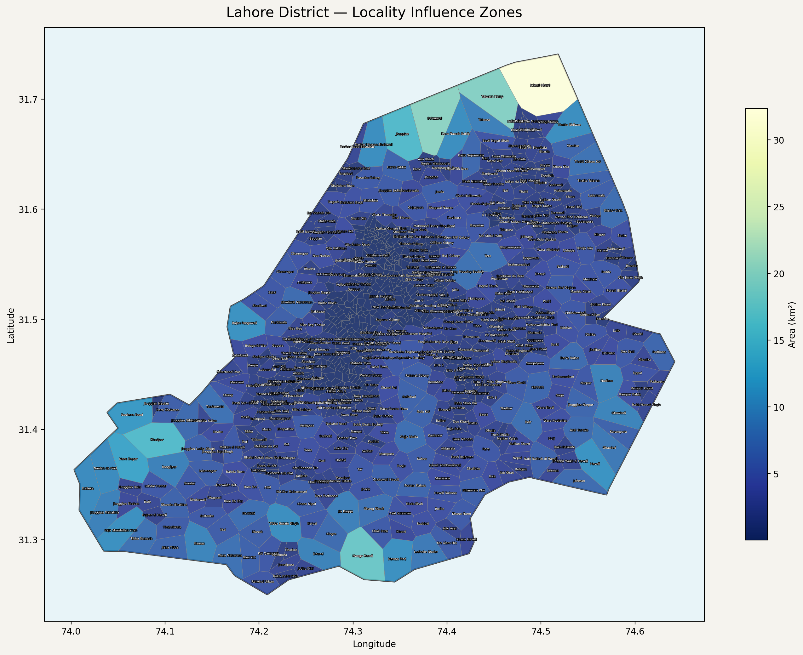
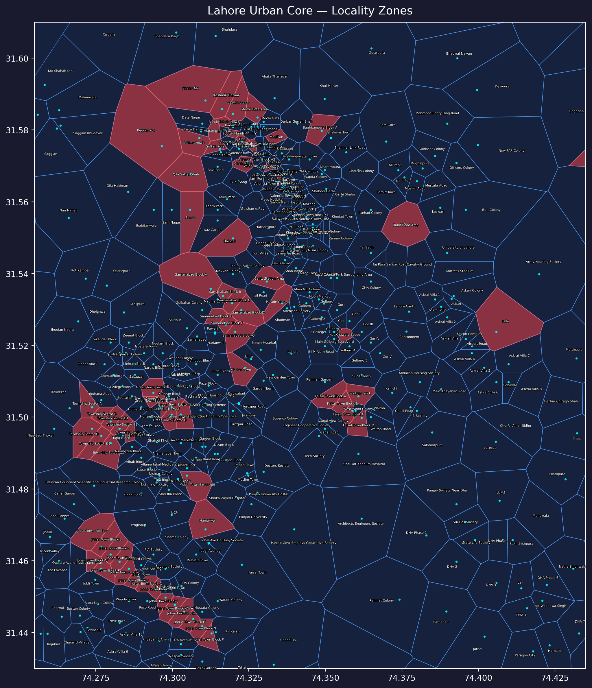
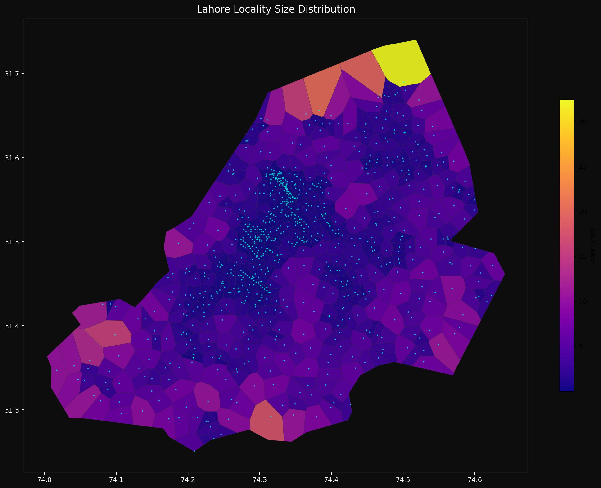
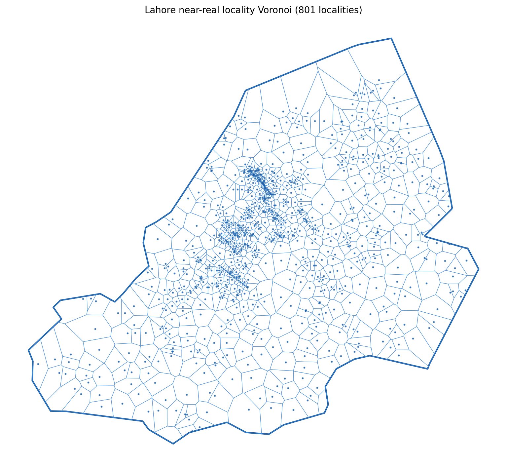

# Lahore Internal Boundaries — Locality Influence Zones

The most detailed openly available sub-district locality map of Lahore, Pakistan.
**801 named localities** covering the entire Lahore District, distributed as Voronoi influence-zone polygons, locality point centroids, and the district boundary — all in Shapefile and GeoJSON formats.

No equivalent dataset exists publicly at this resolution. Official sources publish only tehsil or union council boundaries; this layer fills the gap for neighbourhood-level work.

---

## Maps

### Full District — All 724 Locality Zones

*Each polygon is one named locality. Colour encodes relative area (light = small/dense urban; dark blue = large rural zone).*

### Urban Core — Zoomed View

*The dense urban centre around the Walled City, Cantt, and Gulberg corridor. Red polygons = newly added; red dots = source locality centroids.*

### Size Distribution — Dark Theme

*Plasma palette: bright yellow = largest rural polygons (north-east fringe); deep purple = smallest, most densely packed urban localities. Cyan dots are source points.*

### Clean Overview — All 801 Locality Zones

*Uncoloured wireframe showing all 801 locality polygons and source centroids. Dense cluster in the urban core reflects the high concentration of named localities around the Walled City and inner-city neighbourhoods.*

---

## Why This Dataset Exists

Lahore has hundreds of distinct named localities — from ancient mohallas inside the Walled City to modern housing schemes on the outskirts — but no public vector layer maps their spatial extents. Existing open data offers only:

| Source | Coverage |
|---|---|
| GADM / SALB | Province → District (no sub-district polygons) |
| OpenStreetMap | Partial, inconsistently named, no complete polygon layer |
| Punjab government | Tehsil and Union Council boundaries (not locality-level) |
| Google / commercial | Tile-only, not downloadable as vector data |

This dataset fills that gap using a **Voronoi tessellation** approach: each named locality becomes the polygon of all space closer to its centroid than to any other locality centroid. The result is imperfect at boundaries but far more useful than sparse point labels or no layer at all.

---

## Files

```
lahore_near_real_shapefile/
├── lahore_locality_voronoi.shp      ← locality polygons  (primary layer)
├── lahore_locality_voronoi.shx
├── lahore_locality_voronoi.dbf
├── lahore_locality_voronoi.prj
├── lahore_locality_voronoi.cpg
├── lahore_locality_voronoi.geojson  ← same data, GeoJSON
│
├── lahore_locality_points.shp       ← source centroids used to build polygons
├── lahore_locality_points.shx
├── lahore_locality_points.dbf
├── lahore_locality_points.prj
├── lahore_locality_points.cpg
├── lahore_locality_points.geojson
│
├── lahore_district_boundary.shp     ← Lahore District clip boundary
├── lahore_district_boundary.shx
├── lahore_district_boundary.dbf
├── lahore_district_boundary.prj
├── lahore_district_boundary.cpg
├── lahore_district_boundary.geojson
│
├── metadata.json                    ← source and stats summary
└── README.txt                       ← brief field notes
```

**CRS:** `EPSG:4326` (WGS 84 geographic, all files)

### Attribute fields — `lahore_locality_voronoi`

| Field | Type | Description |
|---|---|---|
| `name` | String | Locality name (de-duplicated) |
| `label` | String | Display label (same as name in most cases) |
| `dup_count` | Integer | Number of source points with this name |
| `area_sqkm` | Float | Polygon area in km² |
| `source` | String | Data provenance tag |
| `method` | String | Construction method (`voronoi`) |

### Attribute fields — `lahore_locality_points`

| Field | Type | Description |
|---|---|---|
| `name` | String | Locality name |
| `name_all` | String | Full name including duplicates |
| `dup_count` | Integer | Duplicate count for this name |

---

## How It Was Built

1. **District boundary** — extracted from PakData/GISData `PAK_adm3.json` (GADM-derived district polygon for Lahore).
2. **Locality points (base)** — 452 named locality coordinates for Lahore parsed from Paintmaps' "Neighborhoods and Villages of Lahore" coordinate list. 432 of these fall within the district boundary.
3. **Corrections** — systematic audit removed 5 erroneous entries (`Title`, `Po`, duplicate `Deo Khund`, `Chachowali`, `Manhiala`) and corrected 5 misspellings (`Wahga` → `Wagah`, `Nisampura` → `Nishampura`, `Talib Canj` → `Talib Ganj`, `Shahdra Bage` → `Shahdara Bagh`, `Pakistan Counsil…` → `Pakistan Council…`).
4. **Manual additions (round 1)** — 34 major post-Partition neighbourhoods added with manually researched centroids: Walled City gates, DHA phases, Johar Town, Bahria Town, Shadman, Ichra, Garhi Shahu, Mughalpura, and others.
5. **User-verified area list (round 2)** — 264 additional localities verified from an online area directory: housing societies, institutional campuses, DHA phases 2–4 and 7–8, Askari Villas 1–10, Gulberg sub-areas (1–5, Gor I–V), Allama Iqbal Town blocks, Sabzazar colony blocks, Valencia Town blocks, and named roads and landmarks.
6. **Voronoi tessellation** — polygons generated from all 461 in-boundary points in a projected CRS (UTM Zone 42N / EPSG:32642) to avoid geographic distortion.
7. **Official UC validation (round 3)** — cross-referenced all names against the official "Geographical Boundaries of Lahore" government PDF (274 Union Councils, 10 Tehsils). 19 names corrected to official romanisation (e.g., `Wagah`→`Wahga`, `Mazang`→`Mozang`, `Hir`→`Hair`). 78 additional sub-UC areas, sectors, and rural localities added.
8. **Voronoi re-tessellation** — polygons rebuilt from all 803 in-boundary points.
9. **Clip** — Voronoi polygons clipped to the Lahore District boundary.
10. **Export** — reprojected back to EPSG:4326 and exported as both Shapefile and GeoJSON.

---

## Usage

### QGIS
1. Drag `lahore_locality_voronoi.geojson` into the QGIS canvas.
2. Optionally add `lahore_locality_points.geojson` as a reference layer.
3. Use **Layer → Labeling** to display the `name` field.
4. For point-in-polygon assignment: **Vector → Analysis → Count Points in Polygon** or use **Join attributes by location**.

### Python (GeoPandas)

```python
import geopandas as gpd

voronoi  = gpd.read_file("lahore_near_real_shapefile/lahore_locality_voronoi.geojson")
points   = gpd.read_file("lahore_near_real_shapefile/lahore_locality_points.geojson")
district = gpd.read_file("lahore_near_real_shapefile/lahore_district_boundary.geojson")

# Assign a locality name to arbitrary points
my_points = gpd.GeoDataFrame(...)   # your data, same CRS
joined = gpd.sjoin(my_points, voronoi[['name', 'geometry']], how='left', predicate='within')
```

### R (sf)

```r
library(sf)
voronoi <- st_read("lahore_near_real_shapefile/lahore_locality_voronoi.geojson")

# Point-in-polygon
my_points <- st_as_sf(my_df, coords = c("lon", "lat"), crs = 4326)
joined <- st_join(my_points, voronoi["name"])
```

### JavaScript / Leaflet

```js
fetch("lahore_near_real_shapefile/lahore_locality_voronoi.geojson")
  .then(r => r.json())
  .then(data => {
    L.geoJSON(data, {
      style: { color: "#2c4a7c", weight: 1, fillOpacity: 0.2 },
      onEachFeature: (feature, layer) => {
        layer.bindTooltip(feature.properties.name);
      }
    }).addTo(map);
  });
```

---

## Stats

| Metric | Value |
|---|---|
| Total locality polygons | 801 |
| Total locality points | 803 (within district) |
| Original Paintmaps points (raw) | 452 (432 in-district) |
| Corrections applied | 5 deletions, 24 renames |
| Manually added (round 1) | 34 major neighbourhoods |
| Added from verified area list | 264 societies, blocks, institutions |
| Added from official UC PDF | 78 UC sub-areas, sectors, and rural localities |
| District area covered | ~1,772 km² |
| Smallest polygon | < 0.1 km² (dense urban core) |
| Largest polygon | ~50 km² (rural fringe) |
| CRS | EPSG:4326 (WGS 84) |

---

## Limitations

- **Not official.** These are influence zones, not legal or administrative boundaries. They do not correspond to Union Councils, Tehsils, or any government-defined unit.
- **Boundary accuracy.** Polygon edges are the mathematical midpoints between neighbouring locality centroids — they will not match any on-the-ground marker or officially recorded boundary.
- **Dense urban areas.** In the Walled City, Shahdara, Ichra, Garhi Shahu, and Mughalpura, many localities are extremely close together. The resulting tiny polygons may not map to the full extent residents would associate with a neighbourhood name.
- **Name coverage.** The dataset contains 461 localities covering both traditional villages and major modern housing schemes. Smaller mohallas, minor housing societies, and industrial pockets may still be missing or absorbed into a neighbour's zone.
- **Best for:** dashboard labelling, proximity-based area assignment, visualisation, exploratory data analysis.
- **Not suitable for:** legal planning, cadastral work, formal administrative reporting.

---

## Suggested Refinements

For higher-stakes applications, consider manually adjusting a small number of zones after visual review:

- **Walled City gates** — Bhati Gate, Delhi Gate, Lohari Gate, Mochi Gate, Shah Alami are now individual polygons but the historic mohallas within each gate area are not further subdivided.
- **DHA phases** — Phase 1, 5, and 6 have separate centroids; phases 2, 3, 4, 7, 8, 9 are not yet individually listed.
- **Cantt (Cantonment)** — has a distinct administrative boundary available from public sources that would be more accurate than the Voronoi zone.
- **Shahdara** — sits across the Ravi; worth splitting along the river where relevant.
- **Bahria Town** — a large private scheme whose actual boundary is well-documented; the Voronoi zone is a reasonable estimate only.

---

## Data Sources

| Source | Use |
|---|---|
| [GADM / PakData GISData](https://gadm.org/) | Lahore District boundary (`PAK_adm3`) |
| [Paintmaps — Neighborhoods and Villages of Lahore](https://www.paintmaps.com/) | Locality name and coordinate list (base layer) |
| Manual research (2024) | 34 major neighbourhoods added with verified centroids |

---

## License

See [LICENSE](LICENSE). The dataset is shared for open use. Attribute the repository if you publish derived work.

---

## Citation

```
Lahore Internal Boundaries — Locality Influence Zones (2025).
GitHub: https://github.com/fatimaazfar/Internal-Lahore-Boundaries
Sources: GADM district boundary, Paintmaps locality coordinates, official Government of Punjab UC boundaries.
Method: Voronoi tessellation (801 localities) clipped to district boundary.
```
